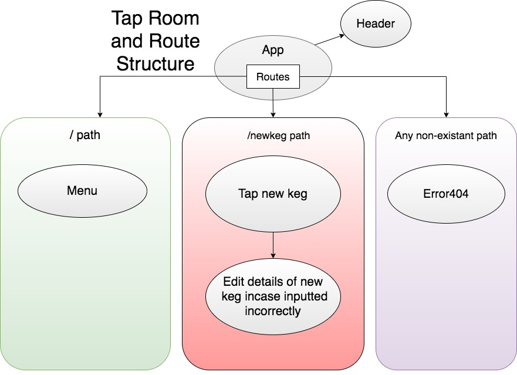

# Buzzed Bob's Bar

#### JavaScript, React Buzzed Bob's Bar, Jake Ash, 2/14/2020_

## Description
Create a react application that can display the beers on the menu, and a form for adding new beers to the tap/menu.

## Diagram




## Screen Shots


## Application should have:

- Linking between pages

## Setup/Installation Requirements

1. Clone this repo:
```
https://github.com/JakeAsh22/TapRoom-react
```

. Go into the repo and run this application: 
```
$ npm install
$ npm run start
```

## Known Bugs
* No known bugs at this time.

## Support and contact details
 jacob.ash1998@gmail.com

## Technologies Used
_Git, GitHub, JavaScript and React_


## License

Copyright © 2020 under the MIT License